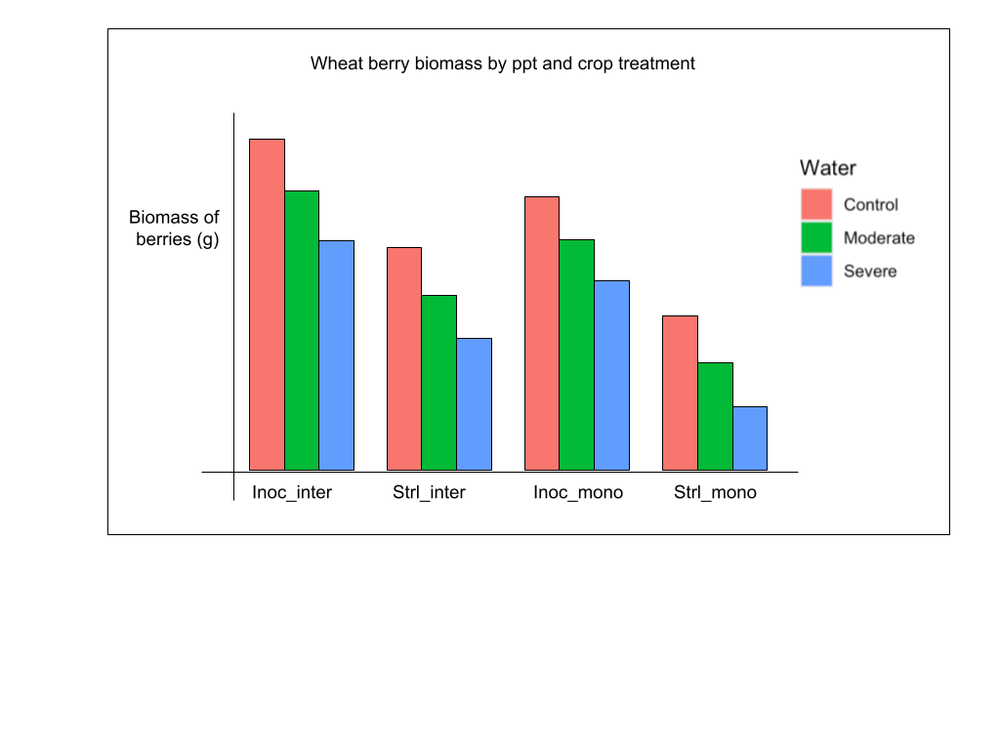

```{r setup, include=FALSE}
knitr::opts_chunk$set(echo = TRUE)
```

```{r, echo=FALSE}

library(tidyverse)
library(broom)
library(knitr)
```
# Berries 

```{r}
# Loading in data to explore
berries <- read.csv("Biomass/Berry_Weights.csv")

berries <- berries %>%
  mutate(
    Inoculation = factor(Inoculation),
    Polyculture = factor(Polyculture),
    Group = interaction(Inoculation, Polyculture, sep = "_")
  )

```

## Part 1: Pretty useless graphs

Clustering without regard to PPT:

```{r pressure, echo=FALSE}
# Without sorting by ppt at all

ggplot(berries, aes(x = Group, y = Biomass_g, fill = Group)) + 
  geom_col()

```

With every replicate individually

This shows the variation by ppt if you just look at inoc and inter status. This is not that informative bc it lumps ppt.

```{r, echo=FALSE}
# With each bar individual; as you can see there is a lot of variation, hopefully due to ppt

berries <- read.csv("Biomass/Berry_Weights.csv")

berries <- berries %>%
  mutate(
    Inoculation = factor(Inoculation),
    Polyculture = factor(Polyculture),
    Group = interaction(Inoculation, Polyculture, sep = "_"),
    Rep = factor(row_number())
  )

ggplot(berries, aes(x = Group, y = Biomass_g, fill = Group)) +
  geom_col(aes(group = Rep), position = position_dodge(width = 0.8))

```

## Part 2: Looking at PPT and what the general behavior is

To begin, here's what I would EXPECT the graph to look like:

```{r}

```
Actual graph

```{r, echo=FALSE}
# With each bar individual and ppt

berries <- read.csv("Biomass/Berry_Weights.csv")

berries <- berries %>%
  mutate(
    Inoculation = factor(Inoculation),
    Polyculture = factor(Polyculture),
    Water = factor(Water, levels = c("Control", "Moderate", "Severe")),
    Group = interaction(Inoculation, Polyculture, sep = "_")
  )

ggplot(berries, aes(x = Group, y = Biomass_g, fill = Water)) +
  geom_col(position = "dodge") +
  ggtitle("Berry biomass by PPT and treatments")

```
Takeaways

* The Inoc_inter and strl_inter groups are behaving as expected, but the inoc_mono and strl_mono are not (especially strl_mono, which is interesting since it is to an extreme of our treatments)
* The common factor is intercropping vs monocropping, potentially
* Inoculation is less significant potentially in the same direction.
* This kind of makes sense, since that factor is less straightforward

## Analyzing these berry biomass trends more in depth

All of the treatments together looking at water: both as a bar graph and boxplot

```{r}

# Bar graph looking at water with the individual points plotted on trop
ggplot(berries, aes(x = Water, y = Biomass_g)) +
  stat_summary(fun = mean, geom = "col", width = 0.6) +
  geom_jitter(width = 0.15, alpha = 0.6) +
  ggtitle("Berry biomass by PPT, all treatments")


```

```{r}
# The same thing (kind of) but as a boxplot with the scattered points

#This code is redundant but good for copy paste later?
berries <- berries %>%
  mutate(
    Water = factor(Water, levels = c("Control", "Moderate", "Severe"))
  )

# The plot
ggplot(berries, aes(x = Water, y = Biomass_g)) +
  geom_boxplot(outlier.shape = NA) +
  geom_jitter(width = 0.15, alpha = 0.6) +
  ggtitle("Berry biomass by PPT, all treatments")
```

Takeaways

* There was a difference between severe compared to control and moderate, but not really within control and moderate…
* Can I average the control and moderate somehow? Should I?

Since the main difference in expectation vs data for the berry biomass was in the monocropped treatments, I decided to break down these boxplots by cropping diversity. Here are the individual boxplots, and then side by side:

These first figures combine inoc and strl. First, just monocropped:

```{r}
# Looking at just monocropped

berries <- berries %>%
  mutate(
    Water = factor(Water, levels = c("Control", "Moderate", "Severe")),
    Inoculation = factor(Inoculation),
    Polyculture = factor(Polyculture)
  )

berries_inter <- berries %>%
  filter(Polyculture == "Mono")

ggplot(berries_inter, aes(x = Water, y = Biomass_g)) +
  geom_boxplot(outlier.shape = NA) +
  geom_jitter(width = 0.15, alpha = 0.6) +
  ggtitle("Berry biomass by PPT, Monocropped treatments only")

```

And looking at intercropped

```{r}
# Looking at just intercropped

berries <- berries %>%
  mutate(
    Water = factor(Water, levels = c("Control", "Moderate", "Severe")),
    Inoculation = factor(Inoculation),
    Polyculture = factor(Polyculture)
  )

berries_inter <- berries %>%
  filter(Polyculture == "Inter")

ggplot(berries_inter, aes(x = Water, y = Biomass_g)) +
  geom_boxplot(outlier.shape = NA) +
  geom_jitter(width = 0.15, alpha = 0.6) + 
  ggtitle("Berry biomass by PPT, Intercropped treatments only")
```

Let's see that side by side and broken down by inoculation status as well

```{r}
# Splitting it by crop treatment

berries <- berries %>%
  mutate(
    Water       = factor(Water, levels = c("Control", "Moderate", "Severe")),
    Inoculation = factor(Inoculation, levels = c("Strl", "Inoc")),
    Polyculture = factor(Polyculture, levels = c("Inter", "Mono"))
  )

ggplot(berries, aes(x = Water, y = Biomass_g, fill = Inoculation)) +
  geom_boxplot(
    outlier.shape = NA,
    position = position_dodge(width = 0.8)
  ) +
  geom_point(
    aes(color = Inoculation),
    alpha = 0.6,
    size = 1.8,
    position = position_dodge(width = 0.8)
  ) +
  facet_wrap(~ Polyculture) +
  theme_bw() +
  labs(
    x = "Water treatment",
    y = "Biomass (g)"
  ) +
  ggtitle("Both Intercropped and Monoculture Berry biomass by PPT")


```
Takeaways

* The intercropped treatments behave more like we would expect (confirming first graph)
* In no treatment is there a real difference between control and moderate PPT
* There is a slight decrease only between control and moderate, so it may have to be dropped, if that’s allowed?
* On the bright side, the severe drought worked!

To conclude our berry work, let's generate some statistics

Before I begin I want to check some assumptions of a t-test!!

```{r}
# Check of distributions
ggplot(berries, aes(x = Inoculation, y = Biomass_g)) +
  geom_boxplot() +
  geom_jitter(width = 0.15, alpha = 0.6) +
  facet_wrap(~ Water) +
  theme_bw() +
  ggtitle("Berry biomass by inoculation status")

# Q–Q plots of residuals
ggplot(berries, aes(sample = Biomass_g)) +
  stat_qq() +
  stat_qq_line() +
  facet_wrap(~ Inoculation + Water) +
  theme_bw() +
  ggtitle("QQ plot of residuals for inoc status")

ggplot(berries, aes(x = Inoculation, y = Biomass_g)) +
  geom_boxplot() +
  facet_wrap(~ Water) +
  theme_bw()


```


```{r}

# Load + clean
berries <- berries %>%
  mutate(
    Inoculation = factor(Inoculation, levels = c("Strl", "Inoc")),
    Polyculture = factor(Polyculture, levels = c("Mono", "Inter")),
    Water = factor(Water, levels = c("Control", "Moderate", "Severe"))
  ) %>%
  filter(!is.na(Biomass_g))

# Descriptive statistics
desc_stats <- function(x) {
  tibble(
    n      = sum(!is.na(x)),
    mean   = mean(x, na.rm = TRUE),
    sd     = sd(x, na.rm = TRUE),
    se     = sd(x, na.rm = TRUE) / sqrt(sum(!is.na(x))),
    median = median(x, na.rm = TRUE),
    q25    = quantile(x, 0.25, na.rm = TRUE, names = FALSE),
    q75    = quantile(x, 0.75, na.rm = TRUE, names = FALSE),
    iqr    = IQR(x, na.rm = TRUE),
    min    = min(x, na.rm = TRUE),
    max    = max(x, na.rm = TRUE)
  )
}

# Each of the 4 treatments within each Water level
summary_4treat_by_water <- berries %>%
  group_by(Water, Inoculation, Polyculture) %>%
  summarise(desc_stats(Biomass_g), .groups = "drop")

# Inoculation only (fold inter/mono together), within each Water
summary_inoc_by_water <- berries %>%
  group_by(Water, Inoculation) %>%
  summarise(desc_stats(Biomass_g), .groups = "drop")

# Polyculture only (fold inoc/strl together), within each Water
summary_poly_by_water <- berries %>%
  group_by(Water, Polyculture) %>%
  summarise(desc_stats(Biomass_g), .groups = "drop")

# Oerall summaries across Water (all data)
summary_4treat_overall <- berries %>%
  group_by(Inoculation, Polyculture) %>%
  summarise(desc_stats(Biomass_g), .groups = "drop")

summary_inoc_overall <- berries %>%
  group_by(Inoculation) %>%
  summarise(desc_stats(Biomass_g), .groups = "drop")

summary_poly_overall <- berries %>%
  group_by(Polyculture) %>%
  summarise(desc_stats(Biomass_g), .groups = "drop")


# Looking at them as tables
summary_4treat_by_water
summary_inoc_by_water
summary_poly_by_water

# Saving these as csvs

write.csv(summary_4treat_by_water,
          file.path(("Biomass/Berries"), "summary_4treat_by_water.csv"),
          row.names = FALSE)

write.csv(summary_inoc_by_water,
          file.path(("Biomass/Berries"), "summary_inoc_by_water.csv"),
          row.names = FALSE)

write.csv(summary_poly_by_water,
          file.path(("Biomass/Berries"), "summary_poly_by_water.csv"),
          row.names = FALSE)

write.csv(summary_4treat_overall,
          file.path(("Biomass/Berries"), "summary_4treat_overall.csv"),
          row.names = FALSE)

write.csv(summary_inoc_overall,
          file.path(("Biomass/Berries"), "summary_inoc_overall.csv"),
          row.names = FALSE)

write.csv(summary_poly_overall,
          file.path(("Biomass/Berries"), "summary_poly_overall.csv"),
          row.names = FALSE)


```
Using AI to generate stats:

```{r}
# These statistics were Chat GPT and should be verified

# P-VALUES: Simple comparisons within each Water ----
# Welch t-tests are robust to unequal variances (default in t.test)

# a) Inoculation effect within each Water (folding Polyculture)
ttest_inoc_within_water <- berries %>%
  group_by(Water) %>%
  do(tidy(t.test(Biomass_g ~ Inoculation, data = .))) %>%
  ungroup() %>%
  select(Water, estimate1, estimate2, statistic, p.value, conf.low, conf.high, method)

# b) Polyculture effect within each Water (folding Inoculation)
ttest_poly_within_water <- berries %>%
  group_by(Water) %>%
  do(tidy(t.test(Biomass_g ~ Polyculture, data = .))) %>%
  ungroup() %>%
  select(Water, estimate1, estimate2, statistic, p.value, conf.low, conf.high, method)

# ---- 3-way factorial model (lets you test interactions) ----
# If your data are fairly normal-ish, this is a strong default.
fit_aov <- aov(Biomass_g ~ Inoculation * Polyculture * Water, data = berries)
aov_table <- broom::tidy(fit_aov)

# ---- Optional: Nonparametric alternatives (in case assumptions are shaky) ----
# Wilcoxon rank-sum within each Water for Inoculation / Polyculture
wilcox_inoc_within_water <- berries %>%
  group_by(Water) %>%
  do(tidy(wilcox.test(Biomass_g ~ Inoculation, data = ., exact = FALSE))) %>%
  ungroup() %>%
  select(Water, statistic, p.value, method)

wilcox_poly_within_water <- berries %>%
  group_by(Water) %>%
  do(tidy(wilcox.test(Biomass_g ~ Polyculture, data = ., exact = FALSE))) %>%
  ungroup() %>%
  select(Water, statistic, p.value, method)

# Print these

ttest_inoc_within_water
ttest_poly_within_water

aov_table

# Saving as CSV

write.csv(ttest_inoc_within_water,
          file.path(("Biomass/Berries/Stats"), "ttest_inoc_within_water.csv"),
          row.names = FALSE)

write.csv(ttest_poly_within_water,
          file.path(("Biomass/Berries/Stats"), "ttest_poly_within_water.csv"),
          row.names = FALSE)

write.csv(aov_table,
          file.path(("Biomass/Berries/Stats"), "anova_3way_table.csv"),
          row.names = FALSE)

write.csv(wilcox_inoc_within_water,
          file.path(("Biomass/Berries/Stats"), "wilcox_inoc_within_water.csv"),
          row.names = FALSE)

write.csv(wilcox_poly_within_water,
          file.path(("Biomass/Berries/Stats"), "wilcox_poly_within_water.csv"),
          row.names = FALSE)


```

